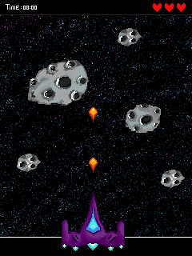

# Eclipse
Десктопная версия аркады в стиле игры 90-х годов с возможностью управления с сенсорного геймпада на основе Arduino Mega 2560 R3 и модуля TFT LCD Touch screen 2.4.


## О команде
Приложение пишется в рамках проектной работы в НИУ ВШЭ СПб.  

**Авторы**: 
* Браун Екатерина (_Геймад и таблица рекордов_)
* Горелова Анастасия (_Логика_)
* Кудашева Алена (_Объекты_)


## Правила игры 
**Суть**: Игра заключается в том, чтобы при помощи космического корабля спасти землю от атаки астероидов.  
**Легенда**: При включении алдруино игрок сразу начинает чувствовать себя настоящим героем. Ему рассказывается история о том, что землю атакуют астероиды и требуется самый отважный житель планеты для грандиозного самопожертвования: сдерживать атаку,  пока земляне запрыгивают на спасательный шаттл. Игроку предоставляется возможность сесть за штурвал космического корабля и задержать астероиды при помощи лазера. Требуется аккуратно и ответственно управлять пушкой, так как если астероид упадет на землю или на корабль, теряется одна из трех жизней. Как только жизни кончаются, планета захвачена, а значит люди не успели покинуть родную планету. Так как мы защищаем землю в одиночку, нам нужна помощь: во время сражения будут появляться дополнительные жизни, которые помогут выстоять длинное сражение. 


 <!-- (## Ход игры
- Игорк подключает ардуино к питанию. 
- Высвечивется менюшка с кнопкой "СТАРТ"
- Высвечивается предыстория, которую можно пропустить. 
- Далее показывается планеты и появляется корабль. 
- В левом верхнем углу таймер, в правом верхнем три жизни. 
- 3.. 2.. 1.. start
- Корабль двигается справа налево в самом низу экрана и бесконечно стреляет вверх лазером.
- Начинают лететь астероиды разного размера. (Чем больше астероид, тем больше выстрелов нужно для его уничтожения)
- Жизни теряются, когда астероид падает на планету (то есть мы его не убиваем) и когда он попадает в сам корабль.
- Иногда в космосе появляются сердечки, добавляющие жизни если их поймать лазером/поймать кораблем
- Когда у корабля кончаются жизни, время останавливается, а корабль перестает стрелять.
- На экзан выводится время в игре.
- Игра начинается заново. -->


<!-- ### Ход идеальной игры (идеи на будущее)
- **Добавить возможность управления и работы на ПК (то етсь реализовать компьютерную версию в дополнение к ардуино)**
- Игорк подключает алдруино к питанию. 
- **Высвечивется менюшка с кнопкой "СТАРТ", мировым рейтингом и обучалкой (мануал по работе с игрой)**
- Высвечивается предыстория, которую можно пропустить. 
- **Высвечивается меню, где вводится имя корабля, который будет спасать планеты в эту итерацию игры**
- Далее показывается планеты и появляется корабль. 
- В левом верхнем углу таймер, в правом верхнем три жизни. 
- 3.. 2.. 1.. start
- Корабль двигается справа налево в самом низу экрана и бесконечно стреляет вверх лазером.
- Начинают лететь астероиды разного размера. (Чем больше астероид, тем больше выстрелов нужно для его уничтожения)
- Жизни теряются, когда астероид падает на планету (то есть мы его не убиваем) и когда он попадает в сам корабль.
- Иногда в космосе появляются сердечки, добавляющие жизни если их поймать лазером/поймать кораблем
- **Иногда появляются монетки (ловить как сердечки)**
- **С какой-то периодичностью появляются промежуточные боссы,после убийства которых высвечивается меню, где за монетки можно купить модификации корабля**
- Когда у корабля кончаются жизни, время останавливается, а корабль перестает стрелять.
- На экзан выводится время в игры.
- **Время добавляется в мировой рейтинг под именем того корабля, на котором была эта игра**
- Игра начинается заново.) -->

## Подключение проекта
### Установка сторонних библиотек
#### MACOS
```
brew update
brew install boost
brew upgrade boost
brew install nlohmann-json
brew install qt5
```
#### LINUX
```
как-то
```
### Запуск игры
```
как-то
```

## Описание функциональностей проекта:

* Главное меню
  + Запуск игры
  + Выбор режима управления 
    - Клавиатура
    - Сенсорный геймпад
  + Легенда 
  + Возможность смены имени пользователя
  + Мануал
  + Локальный leaderboard (результаты учитываются по максимальному времени игры)
  + Глобальный leaderboard 
* Функциональность корабля 
  + Навигация влево и вправо
  + Непрерывная стрельба лазерами вверх 
  + Возможность модификации корабля за монеты 
    - Броня на несколько секунд
    - Усиленный корпус (астероид снимает полжизни)
    - Усиленный лазер (количество выстрелов для разрушения астероидов уменьшается в 2 раза)
* Таймер 
* Система бонусов (ловятся корпусом корабля)
  - Дополнительные жизни 
  - Кристаллы: замедляют игру на 5 секунд
  - Монеты 
* Функциональность игры
  + Система жизней 
    - Три жизни 
    - При попадании астероида в корабль или планету утрата одной жизни 
    - При проигрыше боссу утрата двух жизней
  + Астероиды разного размера (влияет на количество лазеров, нужное для их уничтожения)
  + Астероиды и бонусы летят сверху вниз по прямой, постепенно скорость игры возрастает
  + Со временем траектория полета астероидов меняется на (например) синусоиду
  + Сражение с боссом  
    - Вылетает каждые x секунд (танцуя тектоник, конечно)
    - Патронов для его убийства нужно 2 * max(shoots) / forall shoots / in asteroids
    - Двигается в разные стороны 
  + При проигрыше возможность в течение 5 секунд купить за монеты дополнительную жизнь и продолжить игру
  + Наличие временных интенсивных атак
  + Музыкальное сопровождение 


## Этапы выполнения проекта
* Сделать эскиз итоговой игры



* Продумать архитектуру проекта
* Расписать планы каждого участника до 
* MVP - минимальная рабочая версия проекта
  + Доступно управление с клавиатуры и с геймпада. _(Браун)_
  + Реализованы система жизней и таймер. _(Горелова)_
  + Присутствует минимальный интерфейс меню: кнопки запуска, смена управления. _(Кудашева)_
  + Астероиды разного размера бесконечно летят сверху с одной скоростью. _(Горелова)_
  + Игра заканчивается при обнулении жизней. _(Горелова)_
* Поменять дизайн гравного экрана и меню

 
 

